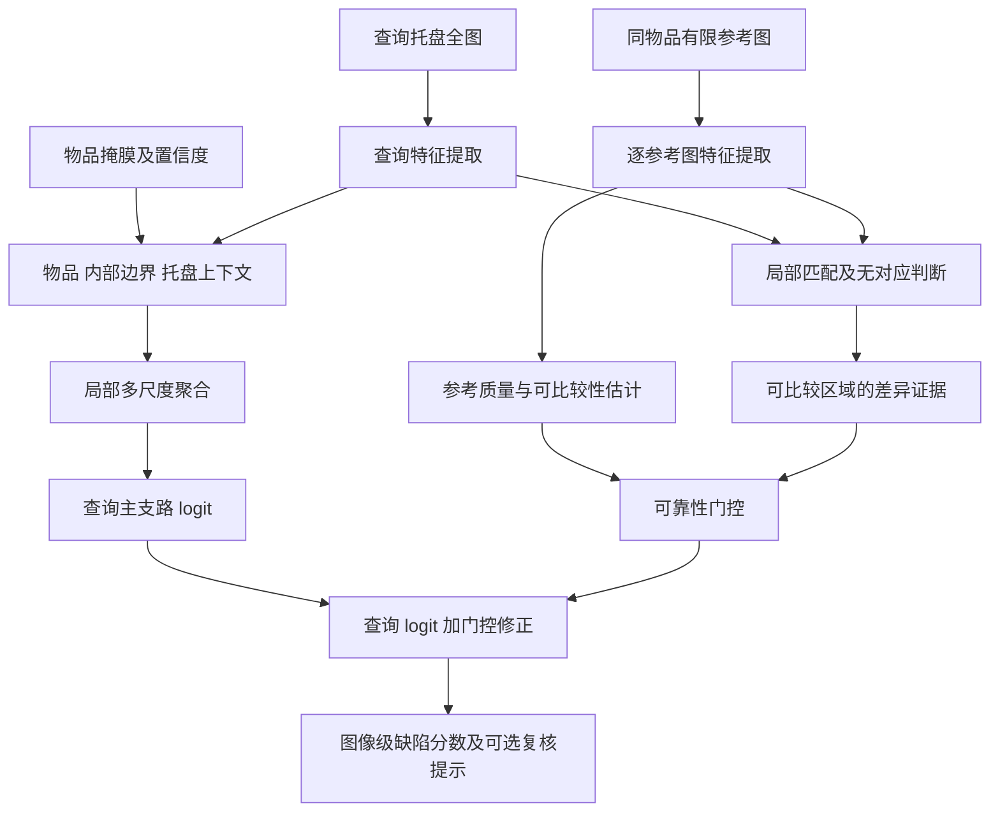

# Kaputt论文优先改进方向与底层原理

分析对象：*Kaputt: A Large-Scale Dataset for Visual Defect Detection*，ICCV 2025，文件`P11_2025_ICCV_Kaputt.pdf`。阅读范围为所提供PDF的全部10页；其中正文止于第8页，第9—10页为参考文献，**本文件不含正文所引用的补充材料**。以下页码均指PDF文件页码，而非印刷页码。

本文区分三种内容：**原文事实**有页码、章节或图表定位；**原理分析**是对已知结果的解释；**改进假设**是建议验证的方案，其公式、结构和效果并非论文已有方法。未运行训练实验，未开展外部论文或专利查新，不对候选方案的新颖性、性能增益或授权前景作结论。

## 一、先给出选择结论

**最值得主攻的方向，是保留查询图像主支路的、可靠性门控的局部参考比较。最容易先落地的结构改动，是物品、边界和托盘上下文分工的局部多尺度检测。训练目标方面，优先利用现成的严重度和多缺陷类型标签，并管理标签不确定性。**

关键判断是：这篇论文主要贡献是**数据集与基准**，没有提出一个可直接逐层替换的原创检测网络。真正值得改进的是它暴露出的输入使用方式、空间表示、监督目标和评测协议。单纯把ResNet50换成更大主干，不足以回答这些问题。

| 顺序 | 改进对象 | 为什么优先 | 底层原理 | 主要代价 |
| --- | --- | --- | --- | --- |
| P0，先行条件 | 固定基线、物品划分、参考预算及低误报评测 | 否则新增模块效果无法归因 | 控制变量、独立评价、部署先验 | 实验与数据审计 |
| P1，主攻方向 | 可靠性门控的局部参考比较 | 论文明确暴露参考融合失败、姿态不匹配及污染参考 | 条件比较、选择性使用信息、保留查询证据 | 匹配开销、可靠性训练/标注 |
| P1，先实现的结构 | 物品/边界/托盘上下文与局部多尺度聚合 | 细小缺陷和盘面溢出有直接原文依据 | 空间角色分解、多实例学习、上下文条件化 | 高分辨率计算、物品mask误差 |
| P1，训练配套 | 严重度序数、多类型标签与不确定性管理 | 标签已经存在，但主要基线按二元BCE训练 | 有序类别、多标签结构、标注噪声建模 | 类别不平衡、原始投票未必可得 |
| P2 | 少缺陷时的正常表征与难负样本学习 | 1%训练缺陷率下性能明显下降 | 表征学习、标签保持不变性、定向负例约束 | 需要严格固定正例预算 |
| P2 | 不确定性、分歧与多样性联合选样 | 论文已有迭代挖掘，但策略细节不足 | 主动学习、探索与利用平衡 | 人工预算、采样偏差 |
| P3，条件性扩展 | 多视角/变化照明及选择性复核 | 有些反光/裂纹或缺件在单张图中不可判断 | 可观测性、额外测量、拒绝不可靠判定 | 采集装置和流程改造 |

这里的顺序是研究与实施建议，不是新颖性评分。推荐开发次序是：**查询基线→局部上下文结构→接入可靠参考支路→结构化监督→少缺陷与污染参考压力测试**。参考机制是研究主线，但应先有稳定查询支路，才能识别它究竟增益还是破坏原有判断。

## 二、论文真正包含哪些结构和方法

### 2.1 数据资源构建链

**原文事实。** 物流物品被单件放置在托盘中，由顶视RGB相机采集；托盘图像正方形裁切后保存为2048×2048。初始缺陷候选由人工提供，后续利用先前标注图像训练的二分类器继续挖掘候选。样本经质量控制、每物品最多15张等规则整理，再按物品标识划分训练、验证和测试。标注含严重度、多种缺陷类型和材料，另提供U-Net生成的**物品掩膜**及带10%填充的物品裁切图。[PDF第4页，§3.1—3.4；第5页，§3.4.2]

**原文事实。** 每个物品关联1—3张未标注参考图，参考通常无缺陷但不保证；查询与参考之间存在姿态、包装和背景变化。同物品标识不跨训练/验证/测试集合。[PDF第2页，图2；第4页，§3.1、§3.3]

**必须保持的边界。** 物品掩膜不是缺陷掩膜；未标注参考不是已确认正常图；同物品标识不是姿态一致的保证。本文没有把这些资源误写成已存在的缺陷区域监督或对齐真值。

### 2.2 被评测的检测结构

| 设置 | 代表方法 | 核心信息使用方式 |
| --- | --- | --- |
| 无训练、无同物品参考 | CLIP、WinCLIP-zero、Claude/Pixtral相应设置 | 通用图文表征或提示；Claude-icl的少量提示示例不等于同物品参考 |
| 无训练、有参考 | PatchCore50、WinCLIP-few | 查询局部特征与参考/记忆库比较 |
| 有训练、无参考 | ResNet50、DINOv2预训练ViT-S、AutoGluonMM | 查询图像级监督分类 |
| 有训练、有参考 | PatchCore50-ft、AutoGluonMM-ref | 任务微调表征加参考比较，或查询/参考嵌入平均 |

来源：PDF第6—7页，§4.2.1—4.2.4。ResNet50、ViT-S、U-Net、PatchCore、CLIP等均为采用的已有方法，不是Kaputt论文新提出的网络模块。

### 2.3 哪些结果支持优先改进

| 原文结果，单位为% | APany | AUROC | R@1%FPR | 对改进的启示 |
| --- | --- | --- | --- | --- |
| ViT-S，有训练、仅查询 | 90.67 | 94.27 | 59.36 | 总体表现较好，低误报下仍漏检不少缺陷 |
| ResNet50，有训练、仅查询 | 81.06 | 88.36 | 30.01 | 表征有影响，但不应只围绕换主干开展研究 |
| PatchCore50，无训练、有参考 | 35.86 | 54.69 | 2.18 | 同物品参考在此方法下未解决正常外观变化 |
| AutoGluonMM，仅查询 | 87.77 | 92.47 | 46.26 | 可作为简单融合的对照参考 |
| AutoGluonMM-ref，嵌入平均 | 71.21 | 84.29 | 13.32 | 应检查均值融合损伤了什么信息 |
| 1%训练缺陷率，ViT Query only | 57.7 | 74.4 | 未报告 | 少缺陷学习是关键压力场景 |
| 1%训练缺陷率，late-fusion ViT Query+ref | 40.4 | 63.2 | 未报告 | 增加参考并不自动增加有效信息 |

来源：PDF第7页表2、第8页表3。表2是不同配置间的基准比较；表3改变了参考输入和融合结构，正文未完整交代所有配对训练细节，**不能据此证明“任意参考方法都会变差”**。原文只为每个方法报告表现最好的tray/item版本，不能从表2算出同一模型裁切与全托盘的独立增益。[PDF第6页，§4.1]

## 三、问题的底层来源：视觉差异没有与缺陷证据分离

**原理分析。** 可以用一个概念生成模型表示图像来源：

$$X=\mathcal R(S,P,B,L,D),$$

其中，$S$为物品身份和固有外观，$P$为姿态/可见面，$B$为托盘背景，$L$为照明和反光，$D$为真实缺陷状态，$\mathcal R$为成像过程。这是本文的分析模型，不是原论文公式。

查询与参考的特征差异可概念性分解为：

$$\phi(X_q)-\phi(X_r)=\Delta_S+\Delta_P+\Delta_B+\Delta_L+\Delta_D.$$

只要姿态、背景或光照差异强于缺陷信号，简单距离就可能把正常变化判成异常。上述分解是解释性近似，各项并不独立或正交，实际非线性表征中还可能相互耦合。因此，不能简单减去背景就宣称已分离所有干扰因素。

另一个问题来自均值融合。假设可比较的正常特征为$z_0$，缺陷查询特征为$z_q=z_0+\delta$，$G$张参考均为$z_0$，则：

$$\bar z=\frac{z_q+\sum_{g=1}^{G}z_{r_g}}{G+1}=z_0+\frac{\delta}{G+1}.$$

缺陷方向$\delta$被压缩为原来的$1/(G+1)$。**这是线性玩具模型对一种可能机制的说明**，不是对原文性能下降的已证实因果解释；后端非线性分类器、参考噪声及训练优化也可能影响结果。但它说明了为什么“保留查询特征、显式构造差异”比直接平均更值得作为对照假设。

## 四、方向一：可靠性门控的局部参考比较

### 4.1 改哪一处

**改进假设。** 用“查询主支路＋局部参考比较＋可靠性门控”替代查询/参考嵌入平均，或无条件把参考全部当正常的记忆库构建。与原文不同点在于**信息流和使用条件**，不只是更换网络名称。

原文依据：参考可能被污染、查询参考正反面不同、AD对姿态/包装变化误报，以及简单参考融合结果下降。[PDF第2页图2；第7页§4.2.4；第8页§4.3]

### 4.2 输入、操作与输出

1. 查询图像独立得到全局/局部特征和查询分类logit，作为无需参考即可运行的主支路。
2. 每张参考图独立编码，保持其自身特征，不先与查询平均。
3. 先估计物品/视角兼容性，再在可比较区域内建立局部匹配。
4. 估计参考质量、局部可见性和匹配可信度；没有可靠对应时标记为不可比较，而不是强行匹配。
5. 由查询特征、匹配参考特征、局部差异及置信信息生成比较结果。
6. 门控决定比较结果是否修正查询判断；参考无效时退回查询支路。

物品标识用于获取同物品参考，**不作为跨集合的类别分类器输入**。新方法的共享网络只由训练集合学习；测试同物品参考可按论文任务定义使用，但不能用测试查询标签训练或调参。

### 4.3 底层原理与一个可实现的表达

令$z_{qj}$为查询区域$j$的特征，$z_{r_gk}$为第$g$张参考区域$k$的特征，$A_{jgk}$为局部匹配权重。对于可匹配区域，$\sum_k A_{jgk}=1$；对于不可匹配区域，另外保留“无对应”状态，不执行强制全匹配。

每张参考的质量估计为$r_g$，查询与参考的视角/外观兼容性为$c_g$，区域可比较性为$v_{jg}$，三者均为$[0,1]$内的估计量。设：

$$U_j=\sum_g r_gc_gv_{jg},\qquad
\omega_{jg}=\frac{r_gc_gv_{jg}}{U_j}\quad(U_j\ge\eta),\qquad\eta>0.$$

有可靠对应时计算局部差异：

$$d_j=\sum_g\omega_{jg}\left\|z_{qj}-\sum_k A_{jgk}z_{r_gk}\right\|_2.$$

阈值$\eta$只在验证集确定。仅当$U_j\ge\eta$且存在有效对应时计算并使用$d_j$；否则将区域标为不可比较并从差异聚合中排除。如果一个样本没有任何有效比较区域，强制样本门控$g=0$。同时把原始$U_j$及有效区域覆盖率提供给门控，不只提供归一化权重，因为权重和为1会掩盖所有参考总可靠性都很低的情况。不能将“没有正常参考”解释成“高异常”，也不能解释成“已经证明正常”。

最终分数可采用：

$$s=\sigma\left(\ell_q+g\,\Delta\ell(q,R)\right),\qquad g\in[0,1],$$

其中$\ell_q$是保留的查询logit，$\Delta\ell$是根据局部比较产生的修正，$g$是样本级可用性门控，$\sigma$为sigmoid。$g=0$时严格退回查询判断。修正允许用于发现额外缺陷证据，也允许在可靠参考支持下修正正常外观引起的误报，但不能声称这个结构自动保证不降低性能。

**门控尤其不能只看异常差异大小。** 真缺陷本来就会引起大差异；若把差异大直接定义为“不可靠”，恰好会屏蔽缺陷。应优先从视角兼容、匹配覆盖、参考自身质量及重复扰动稳定性估计可靠性。

### 4.4 从哪里学习可靠性

- 由同一图像的已知几何变换构造局部对应，先训练匹配能力；这只模拟保留可见面的变换，不等价于真正正反面转换。
- 用**训练查询集中已确认无缺陷的图像**学习正常变化；参考未标注时不自动赋正常真值。
- 必要时另标注少量“可比较/不可比较、明显污染/未见污染”的参考对子集；这是新增数据需求，论文并未提供这些标签。
- 训练时随机移除参考，避免网络必须依赖某个固定参考数量；低可靠参考可用于门控诊断，但不直接作为正常监督。

由于每物品只有1—3张参考，单张参考时不存在多数共识；两三张参考也不足以保证稳健中位数能排除污染。质量估计始终可能出错，应保留查询退路。

### 4.5 最小对照及失败判据

固定主干、查询分辨率、训练集和更新预算，依次比较：查询单支路、均值融合、直接特征差异、局部匹配、局部匹配加门控。分层看同视角/不同视角、1/2/3张参考、已审计参考质量及缺件等参考依赖类型。

应同时检查：低误报召回是否提高，污染参考下是否接近查询基线，门控是否只会全关闭，移除参考是否真正改变参考依赖样本的判断。

可能失败的原因包括：局部过匹配把缺陷“解释掉”；门控全部关闭，所谓增益实际来自查询训练；参考数量太少且可见面不同；相似纹理匹配到错误物理部位。**前后面不可观察关系不能靠二维旋转消除**，这时应退路或复核，而不是宣称已完成姿态对齐。

## 五、方向二：空间角色分解与局部多尺度检测

### 5.1 改哪一处

**改进假设。** 将单一全图分类表示改为物品内部、物品边界和托盘上下文三个角色，并在查询支路使用局部图块聚合。它针对两个不同问题：小缺陷被全局特征稀释；溢出等缺陷证据并不完全位于物品内。

原文依据：托盘上液体/粉末可能是主要缺陷线索；悬垂或突出部分使物品边界难定义；原文采用1024像素输入是为减少细微缺陷下采样损失。[PDF第4页§3.2、图3；第7页§4.2.3；第8页§4.3]

### 5.2 底层原理

若小缺陷只占图像面积比例$\rho$，而全局平均特征中正常区域占主导，缺陷特征对整体的贡献可能随$\rho$减弱。局部化的目的不是把图像全部变成更大，而是让可疑区域仍能形成较强证据。

设物品软掩膜为$M$，利用其位置关系形成内部区域、边界带和托盘区域。边界带宽度为验证集确定的尺度，不能当作论文既定参数。三支路提取$z_{obj}$、$z_{boundary}$及$z_{tray}$，再结合为查询logit：

$$\ell_q=h(z_{obj},z_{boundary},z_{tray}).$$

这些区域应保留必要重叠和mask置信度；错误mask不能把溢出或悬垂部分永久切除。托盘分支不等于“托盘任何脏点都判缺陷”，需要结合物品、边界与盘面信息判断其关联。

### 5.3 仅图像标签时如何训练局部模块

在没有缺陷mask的情况下，可将图像视为图块袋。设第$j$个图块的可疑logit为$a_j$，可用平滑聚合：

$$a_{bag}=\tau\log\left(\frac1K\sum_{j=1}^{K}\exp(a_j/\tau)\right),\qquad\tau>0.$$

其中$K$是图块数量，$\tau$控制接近均值还是强调较大局部响应。这是多实例学习的一种候选聚合方式：图像级缺陷标签用于训练整个袋，**不把正图像的每个图块都当缺陷**。

当$\tau$过小，聚合近似最大值，单个托盘污点、反光或边界噪声可能支配结果；当$\tau$过大，又可能稀释小缺陷。应对照最大池化、top-k与平滑聚合，记录图块数量变化下的误报，而不是预设某种聚合最优。

### 5.4 高分辨率与计算开销

先在现有1024输入条件下验证空间角色分工，再比较2048全图或选择性高分辨率图块。只要新方法使用更多像素或更多图块，就必须加入**同样像素/图块预算的普通基线**，否则无法区分结构改进与计算量增加。

可先粗定位再精看局部，或冻结编码器训练局部头，降低探索成本；但粗定位若遗漏小缺陷，精细支路无法补救，应保留一定均匀覆盖。原文没有提供缺陷框或mask，不能假设已有精确裁切真值。

### 5.5 验证与失败模式

以纯物品crop、纯托盘全图、两支路、三角色支路、三角色加局部聚合逐步消融。重点统计溢出、穿透破损、轻微表面缺陷和自然褶皱/托盘污迹误报子集。

失败可能来自mask误差、托盘背景捷径、局部最大值对噪声敏感或计算开销过高。热力图最多先称为弱监督可疑区域；没有缺陷像素真值时，不报告“缺陷分割精度提升”，也不把注意力图当成因果解释。

## 六、方向三：严重度序数、多类型监督与标注不确定性

### 6.1 为什么不宜始终只保留二元标签

**原文事实。** 标签分无缺陷、轻微、严重；缺陷类型有七种，允许同图多类型。三人独立标注后多数投票，但仍可能有错标，严重度和缺陷可接受性有歧义。[PDF第5页§3.4.2]

**改进假设。** 二元分类任务仍作为最终主任务，同时利用严重度的顺序关系和类型标签学习结构化表征。它不是把任务偷偷换成更容易的严重缺陷分类，而是利用训练时已有信息辅助any-defect检测。

### 6.2 严重度的底层原理：累积事件必须嵌套

令严重度$Y\in\{0,1,2\}$，对应无缺陷、轻微、严重。两个累积事件为$Y\ge1$及$Y\ge2$，后者必是前者的子集，必须满足：

$$P(Y\ge2\mid X)\le P(Y\ge1\mid X).$$

一种可实现参数化为：

$$a=\sigma(u),\quad b=\sigma(v),\quad p_{any}=a,\quad p_{major}=ab.$$

由此得到：

$$P(Y=0)=1-a,\quad P(Y=1)=a(1-b),\quad P(Y=2)=ab.$$

三个概率非负且和为1，严重缺陷概率不会大于任意缺陷概率。训练可用两项累积二元交叉熵或相应类别负对数似然，需用验证集选择，不声称两者效果相同。

### 6.3 多类型的底层原理：可以共存，不能用互斥softmax

七类缺陷头分别输出$t_k=\sigma(w_k^\top z)$，使用逐类BCE，并对未提供或不适用标签设置损失掩码$m_{ik}$：

$$\mathcal L_{type}=\sum_{i,k}m_{ik}\,\operatorname{BCE}(t_{ik},y_{ik}).$$

这里$y_{ik}$是确有记录的类型标签，$m_{ik}$只对可用标签生效；**标签缺失不能无条件当作“该类型不存在”**。例如同一破损包装可以同时存在穿透和溢出，互斥softmax会强迫其竞争，不符合标签结构。

对于采用累积BCE的方案，定义$y_{any}=\mathbf1[Y\ge1]$、$y_{major}=\mathbf1[Y\ge2]$，组合目标可以从下式开始实验：

$$\mathcal L=\operatorname{BCE}(p_{any},y_{any})+\lambda_{major}\operatorname{BCE}(p_{major},y_{major})+\lambda_{type}\mathcal L_{type}.$$

任意缺陷BCE只计算一次，避免将包含该项的完整序数损失再与它相加而造成未说明的重复权重。若改用三类负对数似然，应作为另一目标配置独立比较。各权重只由验证集确定。材料信息可用于分层诊断或独立的辅助建模实验；若直接把材料当缺陷先验，可能学到“纸盒更容易被判缺陷”的捷径，因此不能假定增加材料头必然改善泛化。

### 6.4 三人投票怎样转成噪声信息

**新增数据需求。** 如果保留了原始投票，类别比例可表示为：

$$q_{ic}=\frac{n_{ic}}{3},$$

其中$n_{ic}$为样本$i$被标为类别$c$的人数，分母3要求三人均完成该项标注；存在缺失意见时须改用实际有效票数。严重度应保留三个互斥等级的票数；多缺陷类型则对每一类型分别统计是否存在的票数，不把七种类型压成一个互斥分布。可采用软标签，或将分歧高的样本送复核，而不是完全丢弃分歧。只有聚合标签时，不能从一个多数票标签还原三人的原始意见，也不能伪造上述$q_{ic}$。

投票比例并非真实后验概率的保证：三人可能一起看不见裂纹，或者共同误认印刷孔。因此仍需审计“不可观察”“有缺陷但漏看”“是否可接受”三种不同错误来源。模型一致性也只能是复核线索，不能作为纠正测试真值的唯一依据。

### 6.5 验证与失败模式

在相同编码器、相同输入和相同数据下，比较二元BCE、仅序数、仅类型辅助、二者联合，再单独加入软标签/复核机制。主指标始终保留APany和低FPR召回，另看严重度混淆、稀有类型召回、Brier分数或概率校准。

它可能因罕见类型噪声被放大、多任务损失压制主任务、投票不可获得或严重度本身主观而失败。测试标签修改必须采用预先规定的人审流程，不能看到新模型预测后把不利样本改标。

## 七、方向四：少缺陷时优先学习正常变化与难负例

**原文事实。** 训练缺陷率降至1%时ViT查询单支路APany为57.7%；监督基线仍会对自然褶皱和仿损伤设计误报。[PDF第2页§1；第8页表3、§4.3]

**底层原理。** 少量缺陷不足以覆盖所有“损坏长相”，而已确认正常图像可描述哪些变化不应改变缺陷标签。先学习正常外观的容许变化，再利用有限缺陷监督约束决策边界，有可能降低仅从少量正例学纹理捷径的风险。

优先尝试以下变化，而不是首先训练复杂生成模型：

1. 对已确认正常查询图像做标签保持的几何/光照变换，学习表征稳定性；不同可见面不能由普通二维增广假装得到。
2. 收集并审计印刷假孔、自然褶皱、可接受开口等难负例，验证模型是否减少把外观异常当物理损坏。
3. 若同一训练物品有多个已确认正常图像，可比较同物品正常变化；不能仅凭参考未标注就认定其正常。
4. 在同一正例预算下比较冻结编码器、微调编码器和加入表征目标，避免把增加缺陷标签的收益算到结构上。

裁切增广尤其需要谨慎：有缺陷整图的局部crop可能不含缺陷，不能继承整图正标签作为局部正真值；宜按多实例袋处理。CutPaste等合成异常可以作对照工具，但合成边缘或纹理可能与真实物流缺陷不同，不能把它当真实新增缺陷样本的等价物。

**检验方式。** 固定正常样本池，从缺陷训练样本中建立多种正例预算，例如1%训练缺陷率及更高比例；重复抽样，并保持测试集不变。比较APany、低误报召回、难负例误报及不同类型的性能变化。若只有合成异常检测提升，真实轻微/溢出缺陷不提升，核心假设未得到支持。

## 八、方向五：把迭代挖掘升级为有约束的选样

**原文事实。** 论文用已标注图像训练二分类器发现进一步标注候选，但主文未给出候选阈值、轮数、更新规则和停止条件。[PDF第4页§3.3]

**改进假设。** 不只选择“最像缺陷”的图像，而是结合不确定性、不同支路的可靠分歧和表征多样性。在相同人工预算下，提高新标签提供的信息，而非只是提高选中缺陷的比例。

一个诊断性选样分数为：

$$U(x)=\lambda_1H(p(x))+\lambda_2D_{branch}(x)+\lambda_3d(\phi(x),\mathcal L),$$

其中$H$表示预测熵，$D_{branch}$表示有效支路之间的分歧，$d$为与已标注集合$\mathcal L$的表征距离；没有可靠参考时不能把无效参考分歧直接加入分数。实现时先依据训练池统计将各项归一至可比较尺度，冻结其处理规则，再由验证集选择权重，避免任意特征量纲支配选样。这个公式是候选策略，不是已验证最优算法。

加入物品标识限额，避免一轮反复选同一物品；保留随机探索配额，避免模型对新缺陷“高置信度但错误”时永远不选它。将不可观察样本和可学习的难样本区分处理，前者可能需要采集变化而不是反复贴标签。

**底层机制。** 高缺陷分数侧重已知正例模式；不确定性侧重边界；分歧暴露不同信息源冲突；多样性减少重复。它们不是同一个目标，应单独及联合对照。被主动选择的样本分布会偏离自然物流分布，因此应保存选样轨迹，并用独立、未参与选样的评测集评价；如果估计自然缺陷率，还需有合适随机抽样和包含概率，不能用候选池缺陷比例替代。

在现有标注数据上模拟时，只对训练物品池逐轮开放标签，比较随机采样、最高缺陷分数、熵采样和联合策略，记录性能随标签数量增长的曲线。原数据的完整标签只作为模拟标注接口，不提前用于候选选择或调参。该策略可能因总是选歧义图像、分歧来自无效参考、或多样性只体现商品身份而失败。

## 九、P0：评测与低误报原理必须先固定

### 9.1 训练稀缺与部署稀缺是两件事

原文表3的1%指**训练缺陷率**，不等于测试比例，更不等于实际现场缺陷率。表2测试10067张中缺陷为2089+1117=3206张，约31.85%；这种为评测整理的分布不能直接替代真实物流发生率。[PDF第7页表2；第8页表3]

部署缺陷先验为$\pi$、真阳性率为TPR、误报率为FPR时，精确率为：

$$\operatorname{Precision}=\frac{\pi\operatorname{TPR}}{\pi\operatorname{TPR}+(1-\pi)\operatorname{FPR}}.$$

**纯示例推算。** 如果现场缺陷率假设为1%，并假设现场在同一阈值下仍有TPR59.36%、FPR1%，精确率约为37.5%。沿用基准TPR/FPR需要类条件图像分布和模型表现足够稳定；若物品、姿态或采集条件改变，必须在现场重新估计，不能用这个例子预测实际精确率。这不是论文报告的部署结果，而是说明：即便AUROC为94.27%，稀缺事件场景的报警仍可能含较多误报。

### 9.2 必须保留的控制变量

- 按物品标识互斥划分，训练、验证、测试角色保持原样；新网络和全部阈值只由训练/验证确定。
- 同一方法的全托盘与物品crop做成对实验；不能只挑各方法较好的输入后解释其因果差异。
- 固定预训练来源、输入像素、参考数、训练标签预算、更新步数或明确记录实际计算差异。
- 测试参考的使用按任务定义保留：构建测试物品自己的参考记忆库不等同于偷偷用测试标签；如果跨测试物品更新共享网络，则属于额外转导设置，必须单独说明。
- 参数选择和停止条件不看测试结果；不能因为图像同商品就把其训练/测试记录合并。

### 9.3 指标、阈值和统计单位

主报告保留APany、AUROC、APmajor和R@1%FPR。原文APmajor仅在“无缺陷或严重缺陷”子集计算，不能把轻微样本随意当负例而仍声称采用同一指标。[PDF第6页§4.1]

另报告验证集固定阈值后的测试召回和实测FPR。按测试ROC插值得到的R@1%FPR是性能描述，不等同于事先确定的部署阈值；两者分开呈现。验证集误报约束也不能保证发生分布漂移后仍满足1%。

同一物品有多张查询且共享参考，图像之间并非完全独立。建议对**物品标识簇**重采样计算置信区间，并采用多个训练种子。类型分层时可规定“目标类型缺陷为正例、无缺陷为负例”，同一多类型样本可能进入多个分析，不能把这些分析当作独立证据重复计数。全无缺陷的单一物品没有可定义的AP，不宜直接计算所有物品AP的平均值。

必须新增或核实的诊断信息包括：参考质量、可比较视角、微小/不可观察缺陷及难负例。它们在本PDF中没有完备真值，若靠人工补充，应报告覆盖量和标注规则。

## 十、建议的组合结构及分阶段实验

以下是**改进假设结构图**，不是原论文网络图。物品mask只能辅助空间组织；参考不可用时查询支路仍输出检测分数。

训练阶段以严重度/多类型目标约束共享表征，并对门控和参考依赖单独诊断；推理阶段不使用查询缺陷标签。可选复核提示针对可用性不足或判定不确定，不表示模型已经拥有经过校准的拒绝机制。

| 阶段 | 最小实验 | 主要回答的问题 | 进入下一步的条件 |
| --- | --- | --- | --- |
| M0 | 以主文披露配置建立ViT-S查询基线；核查数据划分与mask | 基线及评价是否可信 | 记录与原表差异；完整复现仍需源码/补充材料 |
| M1 | 固定1024输入，比较全图、crop和空间角色支路 | 收益是否来自上下文分工 | 针对相关缺陷有稳定改善且托盘误报可控 |
| M2 | 同预算比较全局与局部MIL，再加入高分辨率对照 | 局部机制与更多像素谁起作用 | 小缺陷改善超过单纯加像素基线，成本可接受 |
| M3 | 在稳定查询支路上比较均值、差异、局部匹配、门控 | 参考机制是否真的提供有效信息 | 干净/兼容参考有增益，污染/不兼容时退化受控 |
| M4 | 固定结构，加入序数和类型辅助目标，再单独加噪声管理 | 监督结构是否有效 | any-defect主任务不被牺牲，稀有/边界样本改善 |
| M5 | 多个缺陷预算下比较正常表征与难负例学习 | 少缺陷增益是否成立 | 固定正例量后效果仍存在 |
| M6 | 同标签预算模拟四种采样策略 | 选样是否提高标注效率 | 独立验证性能随标注量曲线改善 |

参考污染诊断可设置多个污染水平，如0%、1%、5%、10%，作为**人为压力测试参数**，不是论文数据的真实污染比例。需使用已审计子集，或清楚说明人为替换/扰动方式；若不是同物品的真实污染参考，则只能作为额外异常输入诊断，不能冒称原任务主结果。

建议保留3—5个随机种子作为可调实验预算，报告物品簇置信区间和额外图块/参考编码成本。不预设“必须提升几个百分点”作为已知效果；先验证机制、泛化和成本，再决定是否扩展模型。

## 十一、可观测性扩展，以及暂不应优先做的改动

**可观测性底层原理。** 若两个物理状态在现有RGB/视角下产生不可区分的图像，例如反光条纹与某些裂纹，任何只使用同一观测的分类器都可能受不可约错误限制。多视角、改变照明或额外深度测量的价值在于增加区分信息，而不只是增加模型参数。[原文触发点：PDF第4页图3、第5页§3.4.2]

这是采集系统扩展方向，须另做硬件和重复采集验证，不能写成论文已提供多视角对应数据。对于需要参考才能判断的缺件，参考仍可能不展示关键部位；更强匹配不能创造未被观测到的单元。保留复核或补拍路径，比强迫每张图给高置信度答案更合理。

暂不建议作为首个改进：

| 改动 | 主要问题 |
| --- | --- |
| 只换更大的ViT或VLM | 不直接处理参考不可靠、上下文遗漏和标签歧义；计算与输入差异还可能混淆比较 |
| 把参考全部默认正常 | 与原文明确的参考污染条件矛盾 |
| 对任何正反面都做二维配准 | 不可见面没有真实对应，可能强行制造错误相似性 |
| 完全去除托盘背景 | 可能同时删除溢出等真实缺陷信息 |
| 从物品mask直接训练缺陷分割 | mask语义不匹配，缺陷像素标签没有被提供 |
| 把整图正标签复制给所有crop | 许多局部crop可能没有缺陷，产生标签噪声 |
| 一次堆叠所有损失和模块 | 很难判断有效因素，也难为具体技术效果提供证据 |
| 主要依赖生成文本解释证明正确 | 原文VLM能力受限；流畅解释不等于正确检测或因果依据 |

## 十二、与已有专利初稿如何衔接

本轮推荐的是**后续研究候选**，尚未替换之前的专利初稿。若实际实现选择方向一，关键差异应写为：查询特征保留、逐参考处理、局部可比较判断、参考可靠性估计、无对应处理及门控修正的数据关系；不能只把骨干名称换掉。

选择方向二时，应写清物品/边界/托盘信息如何组织、局部图块如何产生与聚合、mask不确定时如何保留证据；选择方向三时，应写清累积严重度概率、多类型标签掩码、各训练项与预测输出的对应。

实际实现后再同步摘要、独立权利要求、发明内容、一般S步骤、系统模块、附图及实验。不能把本文的假设效果直接写成已实现的性能提升。局部比较、门控、多实例学习等本身是通用技术工具，本次未外部查新，具体组合是否有可保护区别仍待检索和技术事实确认。

## 十三、原文核验索引与未解决事项

| 编号 | 证据对象 | PDF位置 | 在本文的作用 |
| --- | --- | --- | --- |
| E1 | 物流姿态、包装变化与稀缺样本动机 | 第1—2页§1 | 解释为何单一外观分类/参考距离不足 |
| E2 | 图1：七类缺陷与轻微/严重例图 | 第2页图1 | 类型多样性；不是网络结构图 |
| E3 | 图2：参考污染、少参考、背景和正反面变化 | 第2页图2 | 门控和可比较性机制的直接起点 |
| E4 | 表1：资源规模及现有数据集比较 | 第3页表1 | 资源论文定位和规模口径 |
| E5 | 采集、筛选、ID分组及U-Net物品mask | 第4页§3 | 数据流、合法评测边界、mask语义 |
| E6 | 图3：不可观察、复杂和歧义样本 | 第4页图3 | 可观测性、托盘上下文和标签管理 |
| E7 | 图4及三人投票、多类型与材料标签 | 第5页图4、§3.4.2及脚注1 | 结构化监督、分布和共现审计 |
| E8 | 指标、四种设置及最佳tray/item报告规则 | 第6页§4.1—4.2 | 控制变量和指标解释 |
| E9 | 表2、仅查询BCE及参考特征平均 | 第7页表2、§4.2.3—4.2.4 | 基线结构和原文数值 |
| E10 | 表3、定性失败和未来问题 | 第8页表3、§4.3、§5 | 优先方向与可证伪研究问题 |

补充说明：正文仅有图1—4、表1—3，没有图5/图6，也没有编号的新方法公式。§4.1有未编号的分类函数定义；本文出现的门控、MIL、序数和主动选样公式属于分析或提案。

原文总图像238421张、物品48376种、标注查询100267张、缺陷查询29316张、未标注图138154张。§3.3写28.6%缺陷率，而公布查询计数比约为29.24%，其统计口径差异未能从本PDF解决；不把28.6%当作精确发布数据比例。图4对多类型样本按优先类型展示，约72%缺陷样本只有一种类型，不能把图4柱状分布当作完整多标签共现统计。[PDF第1—5页§1、表1、§3.3、图4及脚注1]

尚需进一步获取：完整训练配置/代码、迭代挖掘细则、原始投票是否保留、参考质量与姿态诊断标签、实际物品标识业务含义。1024输入与14像素patch的边界处理也需查看真实实现，不自行假定整除网格。以上缺口影响复现和归因，均不以常见配置填成原文事实。
