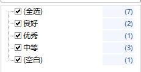
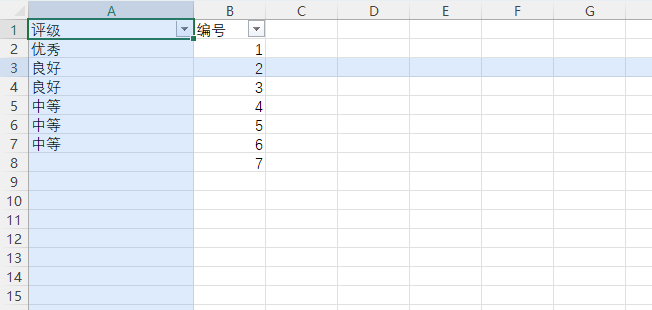

# 1.0.3 测试记录

验证日期：2026-10-05。环境与 1.0.2 相同，为本机 64 位 Microsoft 365 Excel。

## 新增行为

“鼠标光影”与“光影设置”使用专用图标；原“颜色与透明度”按钮重命名为“光影设置”。默认采用点击选中模式，以当前活动单元格为十字交点，移动鼠标保持光影位置；设置中可切换为鼠标跟随。模式、颜色和透明度保存到用户配置；旧配置缺少模式键或模式值无效时采用点击选中，已有外观和开关保留。

选中模式与鼠标模式分别使用活动格和指针格计算光影，筛选预热仍使用指针元数据。修复真实交互测试发现的旧点击位置干扰键盘筛选问题：仅使用近期、与菜单锚点相符的点击，否则取键盘打开菜单时的活动单元格。

## 验证结果

| 项目 | 结果 | 覆盖 |
|---|---|---|
| 基础测试 | AnyCPU 与 x86 各 33 项通过 | 原有计数、设置和共享坐标检查；默认模式、旧配置迁移、模式持久化、无效模式回退、两个图标的原生 IPictureDisp |
| COM ABI | 64 位与 32 位各 21 项通过 | 原有 ABI 检查、重命名标签与专用图标回调声明 |
| 点击选中几何 | 681 项通过 | 合成工作簿以选择操作改变活动格；普通与合并单元格、100%/80%/150% 缩放、冻结滚动；移动指针保持选中光影 |
| 鼠标跟随几何 | 585 项通过 | 相同布局下的指针跟随与覆盖层位置；合并区域目标统一为左上格 |
| 安装后真实界面 | 通过 | Excel EXE 打开用户工作簿的只读副本并自动加载插件；实际鼠标点击定位、移动指针保持光影、功能区两个图标和光影设置标签；开关隐藏与恢复 |
| 设置与生命周期 | 通过 | 真实设置窗口切换两种模式、保存、取消、重新连接后持久化；Ribbon 回调、正常关闭 Excel，退出码为 0 |
| 原生筛选计数 | 通过 | 鼠标点击筛选箭头与键盘打开菜单分别核验每个分类和全选；此前点击其他格不会误统计该列 |
| 安装包与数据保护 | 通过 | 自检、SHA256 校验、已安装三个运行文件与最终 dist 一致；用户原工作簿 SHA256 未变，测试结束恢复此前模式和光影开关 |

最后复核了 Ribbon、设置窗口、两种光影及原生筛选截图。界面测试的点选与绘制等待经过校正：避免单元格边缘的拖动命中，保证 Excel 处于前台，并等待窗口动画完成后截图。验证范围仍包括单一实际 Office 版本，32 位 Office、多显示器混合 DPI、全部拆分布局和超大工作簿未实测。

本地证据：`tests/output/modes-core/`、`modes-core-x86/`、`modes-abi64.log`、`modes-abi32.log`、`modes-installer/`、`modes-selection-foreground/`、`modes-follow-confirmed/`、`modes-dialogs-verified/`、`modes-mouse-verified/`。用户表格、截图、日志和独立频数清单不上传；仓库中的图标由代码绘制，示例表格图片来自合成数据。

# 1.0.2 测试记录

验证日期：2026-10-05。环境：Windows，Microsoft 365 Excel 16.0.20430.20118，64 位，.NET Framework 4.8。

## 鼠标光影性能修复

1.0.1 每次跨格通过独立进程反复调用 Excel COM 查询单元格四边，单次几何定位中位耗时约 515～570ms；光影还需要创建和复制整片工作区位图。1.0.2 将坐标采样移到 Excel 自身 STA 的纯 Win32 定时器上，缓存同格几何，通过共享内存把坐标交给独立界面进程。光影改用三个互不重叠的窄条窗口；普通单元格移动不再读取筛选区域。设置刷新和 Ribbon 更新也在 Excel STA 上执行。

使用实际安装的 COM 插件和自建测试工作簿，移动鼠标并等待光影窗口对准目标格；每种模式采样 24 次，另用 Excel 命中测试复核四角和合并单元格。以下数据为本机实测中位数：

| 模式 | 1.0.1 几何定位 | 1.0.2 坐标采样 | 1.0.2 鼠标移动至光影窗口更新 |
|---|---:|---:|---:|
| 100% 缩放 | 569.68ms | 4.25ms | 142.53ms |
| 80% 缩放 | 544.43ms | 3.88ms | 132.05ms |
| 150% 缩放 | 514.84ms | 3.80ms | 132.83ms |
| 冻结并滚动 | 532.00ms | 4.30ms | 155.03ms |

坐标采样耗时与完整跟随延迟是不同指标。新版完整跟随的 p95 为约 165～177ms，单次最高约 296ms；这些数据不能解释为整体响应仅 4ms，也不保证所有机器和工作簿达到同样速度。

## 最终验证

| 项目 | 结果 | 覆盖 |
|---|---|---|
| 基础自动测试 | AnyCPU 与 x86 各 28 项通过 | 原有计数与设置检查、共享坐标初始状态与完整字段、5000 帧并发一致性、原生定时器销毁重连 |
| 原生 COM ABI | 64 位与 32 位各 19 项通过 | 双接口、原生 vtable、BSTR、生命周期槽、真实 SAFEARRAY 参数 |
| 光影几何与性能 | 585 项检查通过 | 普通与合并单元格、三种缩放、冻结后滚动、真实安装插件的共享坐标与光影窗口位置 |
| 安装后真实启动 | 通过 | Excel EXE 打开用户指定工作簿的只读副本，自动加载 COM 插件、光影行列对准指针格、真实 Ribbon 设置和计数筛选回调 |
| 原生筛选与退出 | 通过 | 每个可见分类及全选数量独立核对、鼠标与键盘打开菜单、插件停用重连、Excel 正常退出且退出码为 0 |
| 安装包自检与文件一致性 | 通过 | 安装器内嵌文件与计划检查；已安装 DLL、VisualHost、NativeMenu 的 SHA256 与最终 dist 文件一致 |
| 原工作簿保护 | 通过 | 测试只操作副本，原文件 SHA256 未改变；临时开启光影后恢复用户原开关 |

计数区域与筛选实现沿用 1.0.1，下方保留该版本的 16 项 Excel 集成检查和指定工作簿 50 项检查记录。1.0.2 重新完成安装后原生菜单逐项核对和真实启动、重连、退出验证。

本地证据：`tests/output/hover-baseline/`、`hover-latency-confirmed/`、`hover-core-x86/`、`hover-fixed-mouse/`、`hover-fixed-dialogs/`。最后人工复核光影及原生筛选截图；测试结束未残留本轮 Excel 或插件辅助进程。包含用户工作簿内容的截图、日志和副本只保留在本地，不上传仓库。

## 验证边界

32 位原生窗口和 ABI 检查通过，尚未在 32 位 Office 中实测。多显示器混合 DPI、其他 Office 版本、所有拆分/冻结布局和超大型工作簿仍需要按实际环境验证。交互测试依赖前台窗口、鼠标与桌面状态，性能数据来自本机有限样本。

# 1.0.1 测试记录

验证日期：2026-10-05。环境：Windows，Microsoft 365 Excel 16.0.20430.20118，64 位，.NET Framework 4.8。

## 修复与最终验证

修复原版 COM 双接口与引用 SAFEARRAY 声明，解决加载时报错。将光影和 WinForms 界面、原生菜单 UI Automation 分离到辅助进程，避免组合运行时的 Excel 退出异常。另修复点击筛选箭头不改变活动单元格时误统计其他列的问题。

最终安装包已在本机覆盖安装。通过 Excel EXE 实际启动指定工作簿的只读副本，验证 Excel 自动加载注册的 COM 插件；未使用直接创建的插件对象替代此验证。鼠标点击筛选箭头和键盘打开菜单均通过，真实 Ribbon 回调能够打开设置与计数筛选窗口。停用、重新启用插件后，Excel 正常退出，退出码为 0。

| 项目 | 结果 | 覆盖 |
|---|---|---|
| 基础自动测试 | 23 项通过 | 重复值、空白、通配符、日期分组、透明度、设置保存、十万行计数、辅助进程协议 |
| 原生 COM ABI | 64 位 19 项、32 位 19 项通过 | 双接口、原生 vtable、BSTR、生命周期槽、真实 SAFEARRAY 参数 |
| Excel 集成测试 | 16 项通过 | 计数、保留其他列条件、数字格式、日期、空白、多个表格、工作簿身份与资源释放 |
| 用户指定工作簿 | 50 项通过 | 五张工作表各等级频数与实际筛选可见行一致；只操作副本；原文件 SHA256 未改变 |
| 安装后鼠标筛选 | 通过 | 活动单元格在 G8 时点击 F5 成绩列筛选；逐项核对并复核截图 |
| 安装后界面与键盘筛选 | 通过 | 自动加载、Ribbon、光影、设置窗口、计数筛选窗口、键盘打开原生菜单、插件重连、正常退出 |
| 安装包自检 | 通过 | 三个内嵌文件 SHA256、COM 类、注册及移除计划、精确禁用项匹配；自检不写注册表 |
| 安装文件一致性 | 通过 | 已安装 DLL、VisualHost、NativeMenu 的 SHA256 与最终 dist 文件一致 |

原生菜单检查覆盖“全选”及每个分类值，计数与独立校验清单一致，并人工复核了截图。检查了每个项目，避免仅凭计数浮层存在就认为功能通过。

本地证据：`tests/output/final-mouse-verified/`、`final-dialogs-verified/`、`final-core.log`、`final-abi64.log`、`final-abi32.log`、`final-excel.log`、`final-workbook/`、`final-installer/`。界面测试依赖交互桌面的前台窗口与鼠标位置；此前一次光影等待超时，未见初始化异常，未单独确定原因；最终鼠标与设置窗口两次完整测试均通过。

## 验证边界

32 位 Office、其他 Office 版本、多显示器混合 DPI、全部复杂数字格式、全部日期层级、超大型工作簿以及所有拆分/冻结布局未实测。32 位 ABI 测试通过不等于 32 位 Office 的实际回归通过。卸载注册和文件移除计划已校验，本轮未执行完整交互卸载。

原生计数依赖 Office 的 UI Automation 可访问性树和菜单位置；无法识别时使用功能区计数筛选窗口。光影使用物理屏幕命中测试，覆盖层不修改工作簿或单元格格式。

用户工作簿、独立校验清单、含工作簿内容的截图和日志均只保留在本地，不上传仓库。下面示例图来自合成数据。

